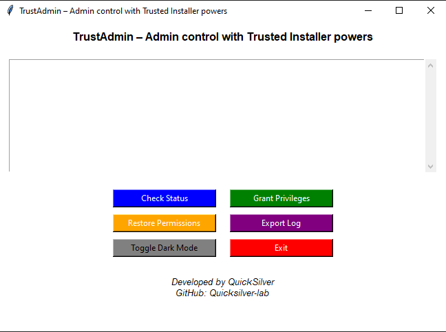

# TrustAdmin - Admin Control with Trusted Installer Powers



## Overview
TrustAdmin is a powerful GUI-based Windows tool that allows administrators to manage system permissions, including granting Trusted Installer privileges and restoring ownership.

## Features
- Check system ownership status
- Grant Trusted Installer privileges
- Restore ownership to Trusted Installer
- Export logs for auditing
- Dark mode toggle

## Download
You can download the latest **EXE** file from the [GitHub Releases](https://github.com/SHARAFATY/TrustAdmin/releases).

**Note:** Windows Defender or your antivirus software may flag the executable as potentially harmful. This is a false positive. The tool is completely safe to use.

## Installation & Usage
### Running from Source
1. Install Python 3.12 or later.
2. Clone this repository:
   ```sh
   git clone https://github.com/SHARAFATY/TrustAdmin.git
   cd TrustAdmin
3. Install dependencies:
    ```sh
    pip install -r requirements.txt
    ```
4. Run the script:
    ```sh
    python TrustAdmin.py
    ```
### Running the EXE
Simply download and run the .exe file from Releases. If Windows SmartScreen prompts a warning, click More info > Run anyway.

### Error Handling
If commands like icacls or takeown are missing, the tool will inform you and guide you on how to proceed.

### Credits
Developed by [QuickSilver](https://github.com/Quicksilver-lab)

License
This project is open-source under the [MIT License](LICENSE).


